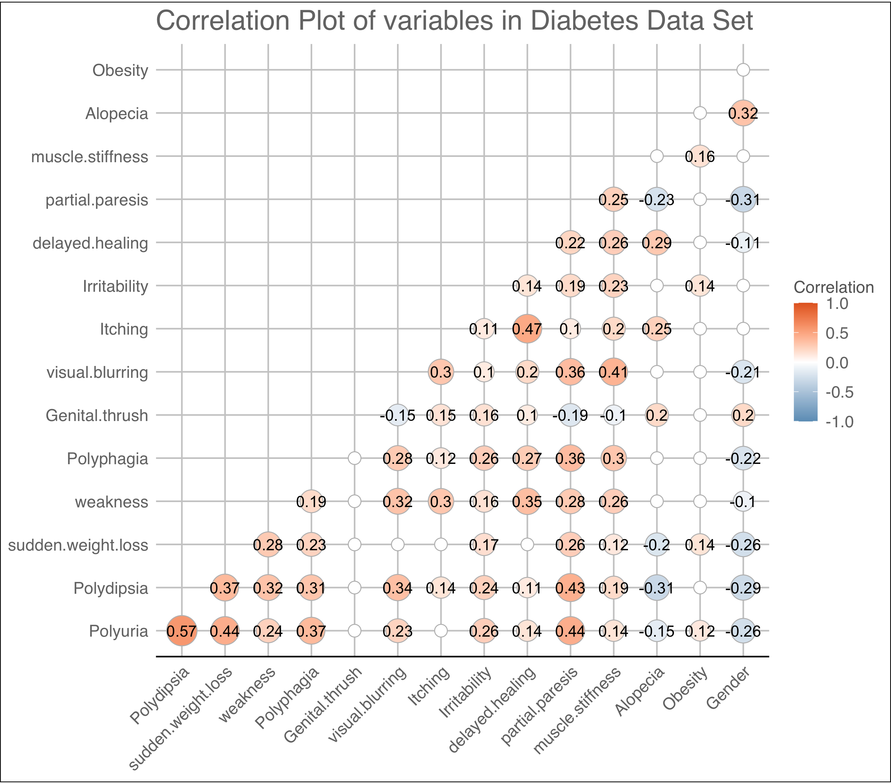
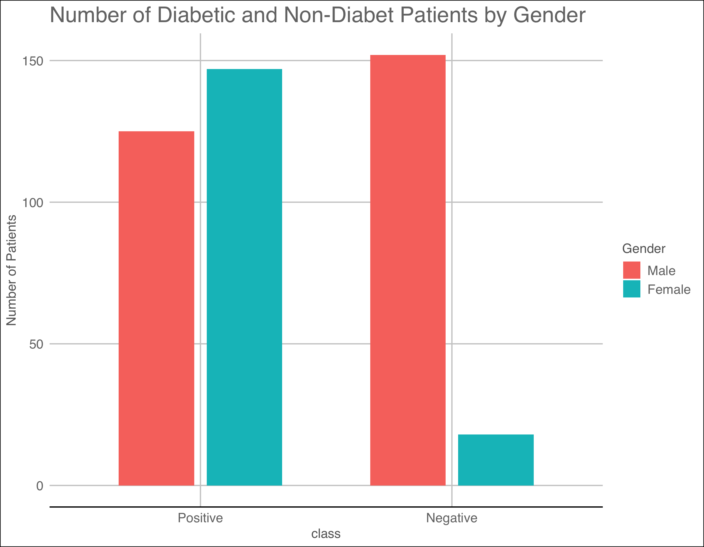
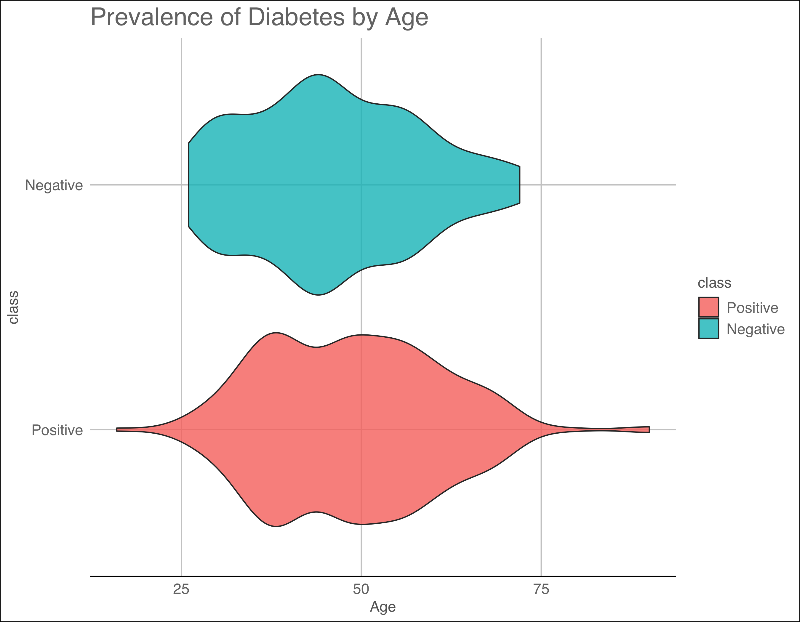

```{r setup, include=FALSE}
knitr::opts_chunk$set(echo = TRUE)
if(!require(tidyverse)) install.packages("tidyverse", repos = "http://cran.us.r-project.org")
if(!require(knitr)) install.packages("knitr", repos = "http://cran.us.r-project.org")
if(!require(kableExtra)) install.packages("kableExtra", repos = "http://cran.us.r-project.org")
library(tidyverse)
library(knitr)
library(kableExtra)
```

# Abstract

Nearly 30% of diabetic people (in the U.S.) don't actually know they're diabetic [10]. Failing to diagnose and treat diabetes can lead to numerous health conditions such as kidney failure and blindness. The internet provides a range symptoms for people to watch out for, however using Google as a self diagnosis tool can be unreliable and, quite frankly, scary. With hospitals being extremely busy during the COVID-19 pandemic, it would be revolutionary if people could find out if they're at risk of being diabetic without having to visit a doctor.


# Introduction
This report aims to construct a machine learning model which predicts whether a patient is at risk of being diabetic. [Approach 1: Logistic Regression] constricts a logistic regression model. [Approach 2: k-Nearest Neighbours] Constructs a k-nearest neighbours model using the Jaccard distance. [Approach 3: Decision Tree] constructs a decision tree. This method is in line with how people may expect doctors to make decisions in reality. [Approach 4: Random Forest] is an extension on [Approach 3: Decision Tree]. [Ensemble] constructs an ensemble of the three best performing models. [Final Model (Results)] retrains the best performing model on a slightly larger data set and assesses its performance using a validation set which is not used for model construction or selection at any point in this report.

The data being worked with is the [Early stage diabetes risk prediction dataset](https://archive.ics.uci.edu/ml/datasets/Early+stage+diabetes+risk+prediction+dataset.). It was created using questionnaires from the patients of Sylhet Diabetic Hospital (Bangladesh) and has been approved by a doctor [[1](https://archive.ics.uci.edu/ml/datasets/Early+stage+diabetes+risk+prediction+dataset.)]. 

For this report, the Early stage diabetes risk prediction dataset is split into a training and a validation set (`diabetes` and `validation` respectively). Only the `diabetes` data set is used for model construction. The `validation` data set is used only for assessing the performance of the *final* model. `diabetes` is split into `train` and `test`. Various models are constructed using `train` and their performances are assessed using `test`. The best performing model is then retrained using `diabetes` and assessed using `validation`. This way, `validation` has no effect on which model is selected to be the final model. The R code used to construct these data sets, models and plots is available in [this](https://github.com/alyomahoney/Diabetes_Project) GitHub repo.

`validation` is 15% of the entire data set and `test` is 15% of `diabetes`. The reason 15% is used for testing and validating in this report is because the data set is quite small. Using 15% instead of 10% for example gives more data to assess the performance of the models. 

# Data Exploration
The structure of the `diabetes` data set is shown below. "Class" is the predictor variable - "positive" indicates the patient has diabetes. The features are made up of age, gender (biological sex) and a selection of conditions including obesity, alopecia and muscle stiffness. The data contains observations from 272 diabetic and 170 non-diabetic patients. Thus, the prevalence of the condition in the data set does not reflect true prevalence, since less than 10% people are estimated to be diabetic [[2](https://www.diabetes.co.uk/diabetes-prevalence.html)].


```{r loading_data, echo = FALSE}
load("rmd_files/rda/structure.rda")
load("rmd_files/rda/final.rda")
load("rmd_files/rda/optimal_values.rda")
load("rmd_files/rda/confusion_matrices.rda")
load("rmd_files/rda/models.rda")
load("rmd_files/rda/results.rda")
cat(str_out[1:18], sep = "\n")
```


Figure 1 below shows a correlation plot of the features in the data set. [Polydipsia](https://en.wikipedia.org/wiki/Polydipsia) and [polyuria](https://en.wikipedia.org/wiki/Polyuria) have the greatest correlation, which doesn't come as a surprise. The non-significant correlations are left blank. Although some of the features have high correlations, no dimensionality reduction takes place in this report. This is primarily because the data set is quite small so it isn't necessary. Another reason is that [Approach 3: Decision Tree] is much more appealing with interpretable features.




This data set suggests that diabetes is more prevalent in females than is it in males, as illustrated in Figure 2. This is perhaps not in line with expectations, as research suggests that men are more likely to develop diabetes than women [[3](https://www.nhs.uk/news/diabetes/men-develop-diabetes-more-easily/)]. This is a reminder that data does not always accurately represent the population it was sampled from. The data set being worked with in this report only accounts for patients from one hospital in Bangladesh, so it would not be wise to make conclusions about diabetes on a world-wide scale.



The distribution for age for positive and negative classes looks reasonably similar. Figure 3 below indicates that the spread for positive classes may be larger, however for the most part there doesn't appear to be a significant difference.



Further exploration can be carried out to discover properties of different features. Figure 4 shows the prevalence of diabetes by polydipsia and polyuria. It appears that if a patient has both polydipsia and polyuria then they are very likely to be diabetic. Otherwise, no confident conclusions could be drawn.


Figure 5 suggests that weakness isn't a condition which is useful in predicting whether a patient is diabetic or not. However, sudden weight loss could be an indication that a patient is diabetic.


Figure 6 suggests that unless a patient has both visual blurring and genital thrush, no real conclusions can be drawn. The plot indicates that patients with both of the conditions are probably diabetic, however there aren't many patients with both conditions to base that claim on. 


Figure 7 is particularly unusual. It suggests that diabetes might not be dependent on obesity. There are numerous studies to suggest that obesity is a significant cause of diabetes, so it is likely that the data set doesn't represent the world population very well.


# Approach 1: Logistic Regression

This section constructs a logistic regression model. The reason logistic regression is used instead of linear regression is that class is a binary variable. Therefore, it is appropriate for a model to predict the probability that the class of a patient is positive, for example.

The general form of a logistic regression model is

\begin{equation}
  \log \left(\frac{\hat{\pi}_i}{1-\hat{\pi}_i} \right)=\mathbf{x}_i^T\beta
\end{equation}

where $\hat{\pi}_i$ is the estimated probability that observation $i$ is positive, $\mathbf{x}_i$ is the $i^{th}$ vector in the design matrix and $\beta$ is the vector of coefficients. In this case, the first element of $\mathbf{x}_i$ is 1 to activate the intercept in $\beta$, the second element of $\mathbf{x}_i$ is the age of observation $i$, and the rest of the elements are 1-0 dummy variables. For instance, the fourth element of $\mathbf{x}_i$ is 1 if observation $i$ does **not** have polyuria, and is 0 otherwise. This is clear when looking at the summary of the final model towards the end of this section.

One choice that has to be made when constructing a logistic regression model is what cutoff to use. The cutoff $p$ is such that $\hat{\pi}_i>p\Rightarrow$ observation $i$ is classed as positive. A typical choice is 0.5, however the context of this problem gives reason to consider a value lower than 0.5. Not identifying a diabetic person is more costly than incorrectly classifying someone who is non-diabetic. If a doctor is 49% certain that a patient is diabetic it is likely that the doctor will proceed assuming that the patient has diabetes. 

Classification models have various measures of performance. One is accuracy, which is the proportion of correctly classified patients. Sensitivity is the proportion of diabetic patients who are correctly classified. High sensitivity implies that a model is likely to correctly classify a diabetic patient. However, this can come at a cost of having low Specificity. Specificity is the proportion of non-diabetic patients that are correctly classified. 

Naively classifying everyone as diabetic would give 100% sensitivity, however it would significantly drop the accuracy. Therefore, this report aims to maximise the mean of the accuracy and the sensitivity. 5-fold cross-validation is used to choose a $p$ which maximises the mean of the accuracy and the sensitivity. Figure 8 shows the results from the cross validation, indicating that `r opt_p` is the optimal choice.


The summary of the model, trained on `train`, indicates that around half of the features are statistically significant. Non-significant features include obesity, visual blurring and sudden weight loss. Statistically significant features include gender, polyuria and polydipsia.

Below the summary is the confusion matrix (tested on `test`) when the optimal cutoff of `r opt_p` is used. The accuracy is `r round(acc_glm,3)` and the sensitivity is `r round(sen_glm, 3)`.

```{r logistic, echo = FALSE}
summary(model_glm)
```

```{r cm_glm, echo = FALSE}
cm_glm
```

```{r results1, echo = FALSE}
results %>%
  slice(1) %>%
  kable(caption = "Table 1: Results after construction of the first model.")
```

# Approach 2: k-Nearest Neighbours

The second approach is to construct a k-nearest neighbours model. A typical distance metric used in kNN is the euclidean distance, however it is not suitable for this data set. Since the features are binary (with the exception of age) it does not make sense for them to be some geographical distance apart. Instead, a common similarity measure used for binary variables is the Jaccard distance [[4](https://people.revoledu.com/kardi/tutorial/Similarity/BinaryVariables.html)], which is used in this report. The neighbr package [[5](https://cran.r-project.org/web/packages/neighbr/neighbr.pdf)] allows for relatively easy implementation for kNN using the Jaccard distance.

Again, 5-fold cross-validation is used to select $k$ which maximises the mean of the accuracy and the sensitivity. The results are shown in Figure 9, highlighting the optimal value of $k=3$.


Following cross-validation, the `train` data set is used to construct a kNN model using $k=3$. The confusion matrix is shown below. Table 2 indicates that the accuracy is the same as the logistic regression model, however the sensitivity is slightly lower. 

```{r cm_knn, echo = FALSE}
cm_knn
```

```{r results2, echo = FALSE}
results %>%
  slice(1:2) %>%
  kable(caption = "Table 2: results after construction of the second model")
```


# Approach 3: Decision Tree

This section constructs a decision tree. One advantage of decision trees is that they are highly interpretable. The way in which decision trees make classifications is in line with how many people would expect doctors to predict the class of a potentially diabetic patient. The rpart package [[6](https://cran.r-project.org/web/packages/rpart/rpart.pdf)] is used to construct the decision tree. However, before, before the model is constructed, an optimal complexity parameter is chosen (the factor by which the models performance needs to improve by to warrant another split). Bootstrap (25 samples of 25% of the data set) is used to select the optimal complexity parameter. The results are shown in Figure 10. This is the default approach taken by the `train` function in the caret package [[7](https://cran.r-project.org/web/packages/caret/caret.pdf)]. The default `minsplit` of 20 and `minbucket` of 7 are used. The results of the bootstrap are shown in Figure 10, indicating that `r round(opt_cp, 3)` is the optimal choice.

One detail that has not been addressed is how the tree's performance is assessed. The complexity parameter means nothing if there is no way to numerically determine a tree's performance. For regression trees the typical choice is  residual sum of squares. However, it does not make sense for decision trees to use residual sum of sqaures as a loss term. Instead, a common choice (and the one used in this report) is the gini index [[9](https://medium.com/analytics-steps/understanding-the-gini-index-and-information-gain-in-decision-trees-ab4720518ba8)]. Thus, a complexity parameter of 0.01 means that the gini index would need to improve by a factor of at least 0.01 for a split to be made. If the split does not satisfy that condition then no further splits are made.

Figure 11 illustrates exactly how the tree makes decisions. The root node makes the first split based on whether the patient has polyuria or not. If they do, they are classed as being diabetic. If not, a further split is made based on the patient's gender, and so on. The percentage at the bottom of each leaf is the proportion of observations in `train` that lie in that leaf. The decimal above the percentage is the proportion of observations in that leaf that are non-diabetic.


Like the logistic regression model, this decision tree returns probabilities, not classes. Again, some cutoff $p$ is chosen such that $\hat{\pi}_i>p\Rightarrow$ observation $i$ is classed as being diabetic. Figure 12 shows the results from 5-fold cross-validation, highlighting the optimal value of `r round(opt_co, 3)` (this is the median of all values of $p$ which share the highest result). Choosing the median $p$ doesn't actually make a difference in this specific model, however this optimal $p$ is used in the next section. It would also potentially make a difference if a decision tree was to be trained on a new data set (`diabetes` for example).

Despite its high level of interpretability, Table 3 shows that the decision tree is the worst performing model. The next section, [Approach 4: Random Forest], expands on the idea of decision trees.


```{r results3, echo = FALSE}
results %>%
  slice(1:3) %>%
  kable(caption = "Table 3: results after construction of the third model")
```


# Approach 4: Random Forest

This model is an extension of the decision tree - a random forest is a collection of decision trees. The way the random forest makes predictions is by some form of majority vote among all of the trees. Trees are constructed in a similar way as the previous section, however at each node a random subset of features is chosen to make the split. This increases the independence between the trees (this parameter is `mtry` in the randomForest package [[8](https://cran.r-project.org/web/packages/randomForest/randomForest.pdf)]). Again, bootstrap (25 samples of 25%) is used to choose an optimal mtry. The results are shown below in Figure 13. The optimal value is 6. The randomForest package takes the default `nodesize` (minimum size of terminal nodes) to be 1 and the default `ntree` (number of decision trees in the forest) to be 500. The cutoff value used in this algorithm is `r round(opt_co, 3)` (calculated in the previous section). The cutoff in the random forest works in the same way as in the decision tree.


The confusion matrix below indicates that the random forest performs very well in comparison to the previous models. it achieves an accuracy of `r round(acc_rf, 3)`, and it also corectly classifies all diabetic patients. Table 4 shows the performances of the first four models.


```{r cm_rf, echo = FALSE}
cm_rf
```

```{r results4, echo = FALSE}
results %>%
  slice(1:4) %>%
  kable(caption = "Table 4: results after construction of the fourth model")
```


# Ensemble

The final model is an ensemble of the three best performing models. Since the decision tree performed the worst, it is omitted from the ensemble. It actually makes sense to drop the decision tree since the random forest is supposed to be a better version.

The ensemble takes a majority vote for each observation from the three models (logistic regression, kNN and random forest) and uses that as its prediction. By dropping one of the four models ties are avoided. Ensembling machine learning models is a great strategy to improve accuracy on test sets - it reduces the reliability on the performance of only one algorithm.

The confusion matrix below comes as quite a surprise - the ensemble actually performs worse than the random forest. More on why this may be the case is discussed in the [Conclusion].


```{r cm_ens, echo = FALSE}
cm_ens
```


```{r results5, echo = FALSE}
results %>%
  slice(1:5) %>%
  kable(caption = "Table 5: results after construction of all the models")
```


# Final Model (Results)

In typical data science projects, it is usually the case that the ensemble achieves the best results. However, in this report the random forest achieves the best accuracy and sensitivity. Therefore, it is selected to be the final model.

The entire `diabetes` data set is now used to construct a random forest. Like before, bootstrap is used to select an optimal mtry. All other parameters remain unchanged. The results from the bootstrap are shown in Figure 14. The optimal mtry value is 5.

The confusion matrix indicates that the random forest achieves perfect accuracy, correctly identifying all patients in the `validation` data set. Although the algorithm couldn't have performed any better, the results should be interpreted with caution. More on this is discussed in the [Conclusion].


```{r cm_final, echo = FALSE}
cm_final
```


# Conclusion
This report constructs a model using `diabetes` and perfectly predicts the class of each patient in `validation`. Though the model performs exceptionally well, there are a few things that are worth discussing. The first is the size of the available data set and the second is where the data is sampled from.

## Sample Size
The `diabetes` data set only has 442 observations. Furthermore, the final model is only tested on 78 observations. The final model would be much more reliable if it was trained and tested on a larger data set. A project like this would benefit from having access to a larger number of observations.

## Where the Data is Sampled From
The second issue is that the data is only sampled from one hospital, Sylhet Diabetic Hospital (SDH). If the data set is a good reflection of the patients admitted to SDH, then the model would maybe be appropriate for use in SDH. However, it would be ill-advised to use this model to predict the class of patients in other hospitals from other countries. A significant improvement on this report would be if the data set was sampled from various hospitals across the world. Thus, the final model would be useful on a global scale.

Using a larger data set taken from a global sample would give the model much more credibility, however it is unlikely that the estimated accuracy of the model would be 100%, like the one in this report. 

On another note, the ensemble actually achieves 100% accuracy on the `validation` data set as well. On a larger data set it might be the case that the ensemble performs better than the random forest. However, if the logistic regression and kNN models were making the same (or similar) mistakes then the random forest would likely perform better. This is something that could be investigated in a future report.

## Potential Impact
Diabetes can have a severe impact on many bodily functions. A machine learning model such as the final model in this report could help to detect diabetes at an early stage. This could prevent strokes, blindness and even amputations in many patients.

A very appealing aspect of the final model is that it is very easy to implement. Where some conditions need medical expertise and advanced equipment, diagnosis for diabetes could be largely aided with a simple questionnaire. Any doctor reading this would rightfully disagree that a diagnosis could be made based solely on a questionnaire, however if a model trained on a more appropriate data set was to also have an excellent performance, it would be a valuable asset. Granted that patients answer the questions accurately, the test could even be made available online. The results could indicate a percentage of a person being at risk, and if the risk was reasonably high (above 10% or so) the person could be advised to seek proper medical advice.

# Acknowledgements

Many thanks are due to Rafael Irizarry, the course instructor of HarvardX's Professional Certificate in Data Science, and to the teaching staff who were always at hand to answer questions and queries raised by students. This edX series has been thoroughly enjoyable and valuable. Irizarry delivered engaging lectures and provided a range of useful coding examples throughout the series.

# References

[1] UCI Machine Learning Repository *Early stage diabetes risk prediction dataset.* [https://archive.ics.uci.edu/ml/datasets/Early+stage+diabetes+risk+prediction+dataset.](https://archive.ics.uci.edu/ml/datasets/Early+stage+diabetes+risk+prediction+dataset.) (date last accessed - 15/10/2020)

[2] Diabetes.co.uk *Diabetes Prevalence.* https://www.diabetes.co.uk/diabetes-prevalence.html (date last accessed - )

[3] Bazain/NHS *Men 'develop diabetes more easily'.* https://www.nhs.uk/news/diabetes/men-develop-diabetes-more-easily/ (date last accessed - ) 

[4] Teknomo, Kardi *Distance for Binary Variables* https://people.revoledu.com/kardi/tutorial/Similarity/BinaryVariables.html (date last accessed - )

[5] Bolotov, D. (2020) *Package 'neighbr'. Classification, Regression, Clustering with K Nearest Neighbors* 

[6] Therneau, T., Atkinson, B. (2019) *Package 'rpart'. Recursive Partitioning and Regression Trees* 

[7] Kuhn, M., ... (2020) *Package 'caret'. Classification and Regression Training* 

[8] Breiman, L., Cutler, A. (2018) *Package 'randomForest'. Breiman and Cutler's Random Forests for Classification and Regression* 

[9] Tyagi, N. *Understanding the Gini Index and Information Gain in Decision Trees* https://medium.com/analytics-steps/understanding-the-gini-index-and-information-gain-in-decision-trees-ab4720518ba8 (date last accessed - )

[10] Williamson DF, Vinicor F, Bowman BA. (2004). *Centers For Disease Control and Prevention Primary Prevention Working Group: Primary prevention of type 2 diabetes mellitus by lifestyle intervention: implications for health policy.*